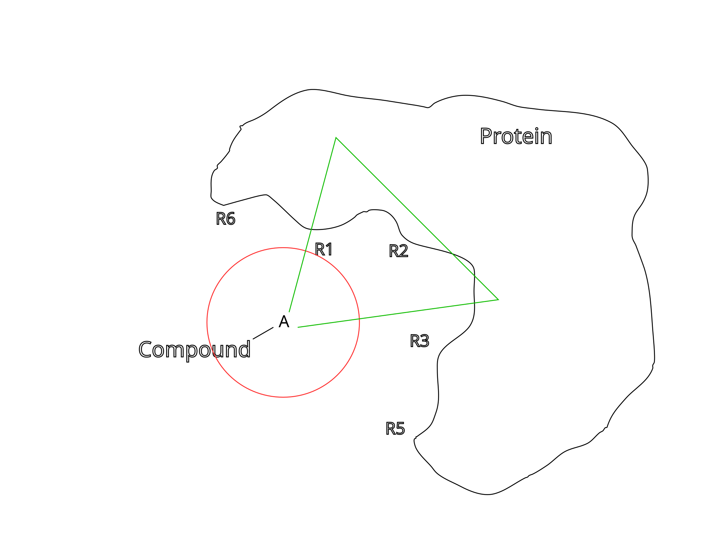

## geoSearch

**Author:** &nbsp;&nbsp;Philip Ullmann 
**Email:**  &nbsp;&nbsp;&nbsp;philip.ullmann@icm.uu.se  
**Place:** &nbsp;&nbsp;&nbsp;Jens Carlsson Lab. Uppsala University  
**Date:** &nbsp;&nbsp;  2024  
**Current Version:** &nbsp;&nbsp;  0.0.1

GeoSearch is a program to determine atoms which are close to ligand hydrogens.  
Currently supported are three types of geometries:  
- Cube
- Sphere
- Cone
- Mandelbulb

# Installation

    pip install -e coding_project

# Usage

    coneSearch -prot [path/to/prot.pdb] -lig [path/to/lig.pdb] -geometry [geometry] -length [length] -o [output]

Special:

-angle (only needed for cone)
-power (only needed for mandelbulb)
-resolution (only needed for mandelbulb)

 
 
 

<tr>
<figure>
    <td>  </td>
    <figcaption><b>Figure 1</b>. Sketch of problem </figcaption>
</figure>
</tr> 
